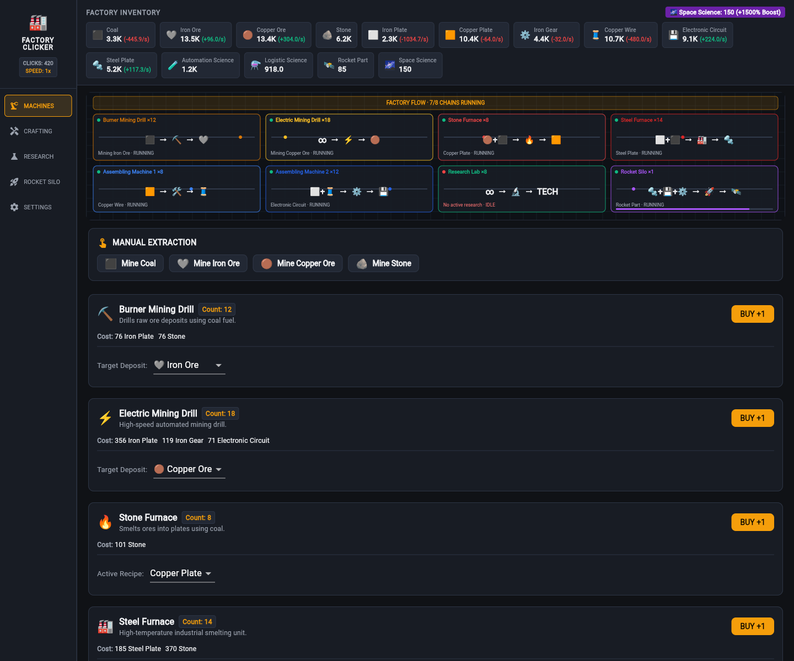

# Factory Clicker

An incremental factory automation game inspired by *Factorio* and *Cookie Clicker*. Start by manually digging raw ores from the dirt and build up to fully automated assembly lines, research laboratories, and an orbital space rocket launch.

---

## Game Overview

### 1. Manual Gathering to Full Automation
* **Raw Extraction:** Mine Coal, Iron Ore, Copper Ore, and Stone to fund your first machinery.
* **Smelting:** Deploy Stone and Steel Furnaces to refine raw ores into structural Iron, electrical Copper, and hardened Steel.
* **Component Assembly:** Automate high-speed manufacturing lines for Copper Wire, Iron Gears, and Electronic Circuits.

### 2. Multi-Tier Technology Tree
* **Automation I:** Unlock automated crafting machines and Red Science data synthesis.
* **Electronics:** Master micro-circuit fabrication to power electric mining drills.
* **Steel Metallurgy:** Upgrade to industrial high-temperature smelting units.
* **Logistics & Chemistry:** Produce Green Science packs to unlock complex automated manufacturing.
* **Rocketry:** Construct the massive Orbital Rocket Silo.

### 3. Space Rocket Prestige Loop
* Assemble 100 high-density Rocket Parts to prepare a satellite payload.
* Launch the rocket into orbit to earn permanent **Space Science Artifacts**.
* Each Space Science artifact provides a lasting global productivity multiplier across future runs.

---

## Key Features
* **Real-Time Simulation:** 20 Hz discrete production engine with deterministic recipe pipelines.
* **Live 2D Factory Floor:** Animated conveyor belts, spinning machine gears, and glowing smelter furnaces.
* **Offline Catch-Up:** Automatic simulated progression when returning after time away.
* **Save Portability:** Local storage autosaves with instant JSON export and import for seamless backup.
